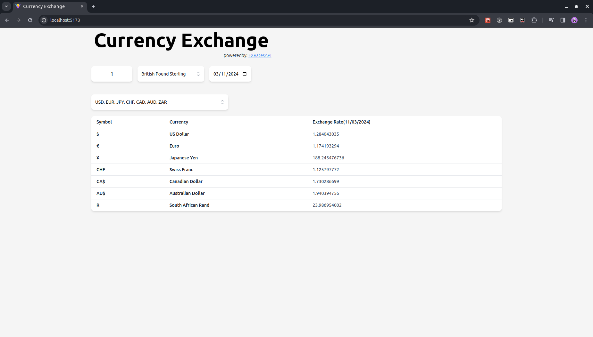
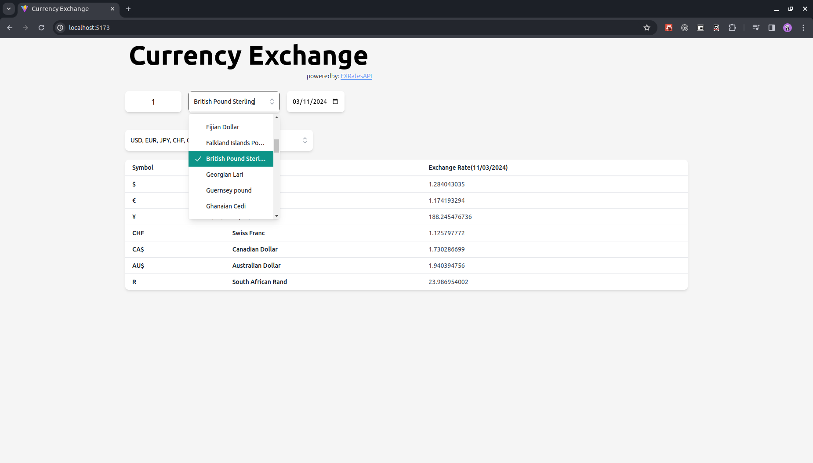
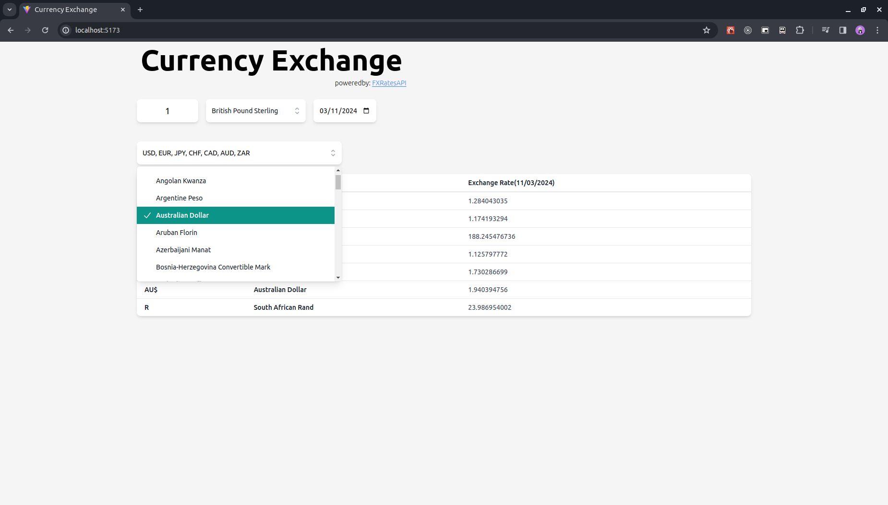

# Currency Exchange

Simple currency exchange app build with React.

## Table of content

- [Technologies](#technologies)
- [Screenshots](#screenshots)
- [Getting Started](#getting-started)
- [License](#license)

## Technologies

- Typescript v5
- React v18
- Vite v5
- TailwindCSS v3
- HeadlessUI v1
- TanStack Query v5
- Prettier v3
- ESLint v8

## Screenshots

### Landing Page

   

### Select Base Currency

  

### Select Comparison Currencies

  

## Getting Started

### Prerequisites

- Node >= 18.0
- NPM >= 9

### Installation

1. Clone the repository:
   ```bash
   git clone git@github.com:idrisGadi/currency-exchange.git
   ```
2. Navigate to the project directory:
   ```bash
   cd currency-exchange
   ```
3. Install dependencies:
   ```bash
   npm install
   ```

### Usage

1. Run locally:
   ```bash
   npm run dev
   ```
2. Build:
   ```bash
   npm run build
   ```

## License

Currency Exchange is licensed under the [MIT License](./LICENSE).
